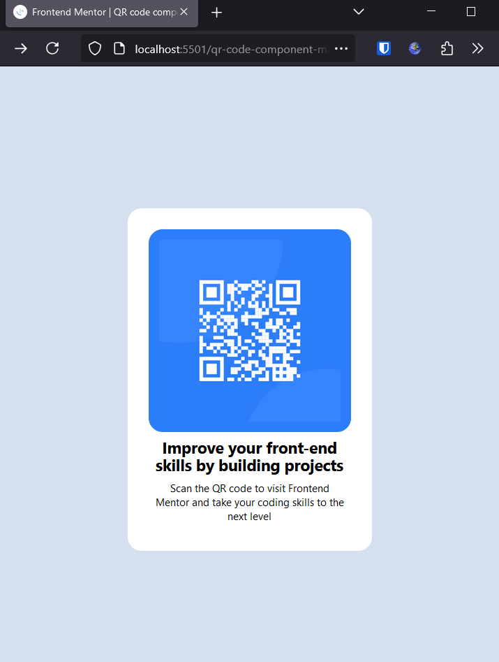

# learn-frontend-mentor
# Frontend Mentor - QR code component solution

This is a solution to the [QR code component challenge on Frontend Mentor](https://www.frontendmentor.io/challenges/qr-code-component-iux_sIO_H). Frontend Mentor challenges help you improve your coding skills by building realistic projects. 

## Table of contents

- [Overview](#overview)
  - [Screenshot](#screenshot)
  - [Links](#links)
- [My process](#my-process)
  - [Built with](#built-with)
  - [What I learned](#what-i-learned)
  - [Continued development](#continued-development)
  - [Useful resources](#useful-resources)
- [Author](#author)
- [Acknowledgments](#acknowledgments)

## Overview

### Screenshot

### Links

- Solution URL: [Add solution URL here](https://your-solution-url.com)
- Live Site URL: [Add live site URL here](https://your-live-site-url.com)

## My process

### Built with

- HTML5 markup
- CSS - TailwindCSS - Using the cdn option for working with a local static index html 

### What I learned

I'm into the project based learning and this seems to be a well documented and supportedframework or activity.
I am just trying to get the process down with this first experiment., I did learn quite a bit aboutall the little thingsfor working with the files and creating this readme for example.Right now I'm trying to figure out how to get screenshots intoa file and displayed in a read me.
I would say that it underlines the need to create projects and not just watch videos or take notes. Building with your "hands" is important.

### Continued development

Creating a simple card is how modern web development is done so right off the bat I feel a little more comfortable with creating these component cards.

### Useful resources

I used a Brad TraverseC tailwindCSS tutorialto guideme and thetailwindCss.com documentation.
https://tailwindcss.com/docs/line-height

## Author

- Frontend Mentor - [@Newman5](https://www.frontendmentor.io/profile/newman5)

